# Reddit News Digest

<p align="center">
  <strong>A Human-Centered Data Science dashboard for turning Reddit discussions into topic-focused, multi-perspective digests.</strong>
</p>

<p align="center">
  
  
  
  
</p>

---

## Overview

**Reddit News Digest** is an interactive dashboard that analyzes Reddit-style datasets and converts raw discussion records into readable, topic-scoped digests.

The application lets users choose a dataset, enter a topic, filter relevant records, cluster similar content into perspectives, score credibility signals, and explore results through a clean Streamlit interface.

The goal is to reduce information overload and make social media discourse easier to interpret.

---

## What It Does

| Capability | Description |
|---|---|
| Topic Filtering | Finds Reddit records that strongly match the user's topic keywords |
| Relevance Scoring | Ranks records using title, body, subreddit, and domain matches |
| Text Vectorization | Converts text into TF-IDF vectors for analysis |
| Clustering | Uses KMeans to group similar records into perspectives |
| Credibility Signals | Scores records using engagement, source, text quality, and risk indicators |
| Digest Generation | Creates readable summaries for each discussion perspective |
| Visual Analytics | Shows cluster, credibility, subreddit, and source-domain breakdowns |
| Data Export | Allows users to download analyzed results as CSV |

---

## Dashboard Preview

The app contains three main sections:

| Page | Purpose |
|---|---|
| **About** | Explains the project and gives recommended search examples |
| **Run Analysis** | Lets the user choose a dataset, enter keywords, and run the pipeline |
| **Explore Results** | Shows the digest, perspective cards, visualizations, and data preview |

---

## System Pipeline

```mermaid
flowchart LR
    A[Raw Reddit CSV] --> B[Adaptive Column Detection]
    B --> C[Text Cleaning]
    C --> D[Keyword Extraction]
    D --> E[Keyword Expansion]
    E --> F[Weighted Relevance Filtering]
    F --> G[TF-IDF Vectorization]
    G --> H[KMeans Clustering]
    H --> I[Credibility Scoring]
    I --> J[Cluster Summaries]
    J --> K[Streamlit Dashboard]
```



---

## Technical Stack

| Area | Tools / Methods |
|---|---|
| Language | Python |
| Dashboard | Streamlit |
| Data Processing | pandas, numpy |
| Text Processing | regex, keyword extraction, alias expansion |
| NLP Features | TF-IDF, unigrams, bigrams, stopword removal |
| Machine Learning | KMeans clustering, scikit-learn |
| Visualization | matplotlib, Streamlit metrics, Streamlit dataframes |
| Output | JSON, CSV, TXT |

---

## Core Methods

### 1. Adaptive Column Detection

The app supports different Reddit-style CSV formats by detecting common column names automatically.

Supported examples include:

```text
title, headline, post_title
body, selftext, text, content, description
subreddit, community
score, upvotes, ups
num_comments, comments, comment_count
url, link, permalink
created_utc, created, date, timestamp
```

This allows the same app to work with both post-level and comment-level datasets.

---

### 2. Text Preparation

The app builds a unified text field called `analysis_text`.

For post-level data:

```text
analysis_text = title + body
```

For comment-level data, the app uses the best available text column, such as `body` or `text`.

The cleaning stage filters:

- deleted or removed content
- AutoModerator-style records
- megathreads and daily discussion threads
- very short records
- extra whitespace and HTML fragments

---

### 3. Keyword Expansion and Relevance Filtering

Users enter a topic or keyword group, such as:

```text
AI, artificial intelligence, automation, jobs, technology
```

The app expands known terms using an alias map.

Example:

```text
AI → AI, artificial intelligence, machine learning, automation, ChatGPT, OpenAI
```

Each record receives a weighted relevance score:

| Match Location | Weight |
|---|---:|
| Title | +4.0 |
| Body | +2.0 |
| Subreddit | +1.0 |
| Domain | +0.5 |

The title receives the highest weight because post titles usually contain the clearest topic signal.

The app also uses exact word matching to reduce false matches. For example, `AI` will not match unrelated words like `said` or `claim`.

---

### 4. TF-IDF Vectorization

After filtering, the app converts text into numerical vectors using TF-IDF.

```python
TfidfVectorizer(
    stop_words="english",
    max_features=4000,
    ngram_range=(1, 2),
    min_df=1,
    max_df=0.95
)
```

This configuration uses:

- English stopword removal
- up to 4000 features
- single words and two-word phrases
- filtering of extremely common terms

---

### 5. KMeans Clustering

The app groups similar records into perspectives using KMeans.

```python
KMeans(
    n_clusters=n_clusters,
    random_state=42,
    n_init=10
)
```

The user selects the number of perspectives from the sidebar.

Each cluster becomes a perspective card in the final digest.

---

### 6. Credibility Scoring

The credibility score is a transparent heuristic signal. It is **not** a factual truth label.

The score uses:

| Signal | Purpose |
|---|---|
| Reddit Score / Upvotes | Measures engagement |
| Number of Comments | Measures discussion activity |
| Title and Body Length | Estimates text quality |
| Source Domain | Adds source reliability signal |
| Risk Keywords | Penalizes toxic or misinformation-style language |

Engagement values are log-normalized:

```python
log1p(score)
log1p(num_comments)
```

Credibility levels:

| Score Range | Label |
|---:|---|
| 75+ | High |
| 55–74 | Moderate |
| 35–54 | Low |
| Below 35 | Very Low |

---

### 7. Cluster Summarization

Each cluster summary is generated using an extractive, template-based approach.

The app uses:

- top TF-IDF cluster keywords
- strongest representative records
- most common subreddits
- most common linked domains

This keeps the summary explainable and avoids overclaiming from noisy Reddit data.

---

## Visualizations

The dashboard includes charts for:

- records by perspective
- credibility breakdown
- top subreddits
- top linked domains
- high-credibility records by cluster
- maximum-score records by cluster

It also includes a perspective snapshot table with:

- perspective number
- cluster ID
- number of records
- percentage share
- credibility score
- credibility level
- top keywords

---

## Datasets

### Included Dataset

This repository includes:

```text
reddit_news.csv
```

This is a smaller Reddit news/post-level dataset used for the main demo.

### Large Dataset

The app can also run on the larger Reddit comments dataset:

```text
kaggle_RC_2019-05.csv
```

This file is **not included** in the repository because it is approximately **177 MB**, which exceeds GitHub's standard 100 MB file size limit.

To use the large dataset:

1. Download the Kaggle Reddit Comments May 2019 dataset.
2. Place it in the project root folder.
3. Ensure the file is named:

```text
kaggle_RC_2019-05.csv
```

Expected local structure:

```text
reddit-news-digest/
├── app.py
├── reddit_news.csv
├── kaggle_RC_2019-05.csv
├── requirements.txt
├── README.md
└── output/
```

The app will automatically detect the CSV and show it in the dataset dropdown.

---

## Installation and Usage

### 1. Clone the Repository

```bash
git clone https://github.com/dipalthaker/reddit-news-digest.git
cd reddit-news-digest
```

### 2. Create a Virtual Environment

```bash
python3 -m venv venv
```

### 3. Activate the Virtual Environment

macOS / Linux:

```bash
source venv/bin/activate
```

Windows:

```bash
venv\Scripts\activate
```

### 4. Install Dependencies

```bash
pip install -r requirements.txt
```

### 5. Run the App

```bash
streamlit run app.py
```

The app will open in your browser.

---

## Recommended Search Examples

Use multiple specific keywords instead of one broad word.

```text
AI, artificial intelligence, automation, jobs, technology
climate, weather, storm, flooding, heat
election, voting, candidate, government, policy
graduate school, degree, university, students, tuition, education
jobs, layoffs, salary, workers, unemployment, paycheck
```

Avoid vague one-word searches like:

```text
AI
jobs
politics
masters
news
```

Specific keyword groups produce cleaner and more relevant digests.

---

## Repository Structure

```text
reddit-news-digest/
├── app.py
├── reddit_news.csv
├── requirements.txt
├── README.md
├── output/
│   └── .gitkeep
└── .gitignore
```

Optional local-only dataset:

```text
kaggle_RC_2019-05.csv
```

This file is not included in GitHub because it exceeds GitHub's file size limit.

---

## Limitations

- The credibility score is heuristic and should not be treated as a verified truth score.
- Reddit data can be noisy, biased, or incomplete.
- Some topics may not have enough matching records in the dataset.
- TF-IDF captures word-based similarity but not deep semantic meaning.
- KMeans requires the number of perspectives to be selected manually.
- The app does not currently perform claim-level fact verification.
- The app does not currently use live Reddit API data.

---

## Future Improvements

Potential upgrades include:

- claim extraction and factual verification
- Google Fact Check Tools API integration
- ClaimBuster integration
- stronger source reliability database
- semantic embeddings with SentenceTransformers
- UMAP or PCA cluster visualization
- real-time Reddit API support
- user personalization based on topic preferences
- adjustable credibility thresholds
- timeline analysis of discussion changes over time

---

## Team

**Group 3**  
Human-Centered Data Science  
Group 3
Spring 2026

- Dipal Thaker
- Yashvi Bhatt
- Malhar Gudekar

---

## Disclaimer

This dashboard summarizes Reddit discussion patterns and provides heuristic credibility signals. It should not be interpreted as a factual news verification system. Users should verify important claims through trusted sources, official reports, or professional fact-checking organizations.
